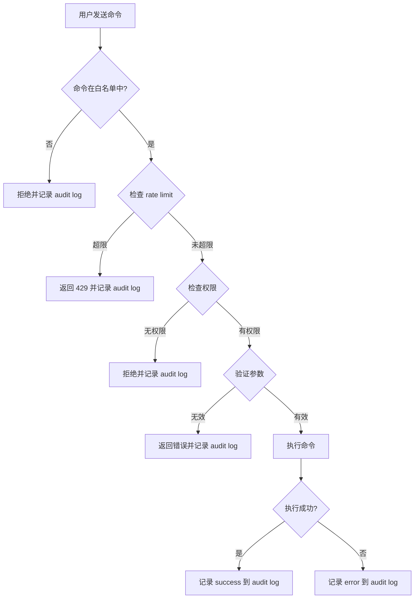

# ContentOps Bot 命令白名单

## 概述

ContentOps Telegram bot 只能执行白名单中的命令。所有其他命令都被拒绝并记录到 audit log。

## 白名单命令

### Draft 管理

#### create-draft

创建新的 draft 内容。

```bash
scripts/create-contentops-draft.ts \
  --type=checklist|guide|topic \
  --payload='{"slug":"...","title":"...","metadataJson":{...}}'
```

**参数**:
- `--type`: 内容类型（checklist/guide/topic）
- `--payload`: JSON 格式的 draft 数据

**示例**:
```bash
scripts/create-contentops-draft.ts \
  --type=checklist \
  --payload='{
    "slug": "student-pre-departure-checklist",
    "title": "留学行前准备清单",
    "metadataJson": {
      "contentOps": {
        "seo": {
          "primaryKeyword": "留学行前准备",
          "secondaryKeywords": ["出国准备", "行前清单"],
          "metaKeywords": ["留学", "行前", "准备", "清单", "出国"],
          "searchIntent": "informational",
          "targetAudience": "准留学生",
          "audienceStage": "准备出国阶段",
          "targetCountries": ["加拿大", "美国"],
          "targetSearchEngines": ["google", "bing"]
        }
      }
    }
  }'
```

**权限**: ✅ 允许
**Rate Limit**: 5 次/分钟/chatId

---

#### validate-draft

验证 draft 数据完整性。

```bash
scripts/validate-contentops-draft.ts --draftId=contentops-cli-e2e-test-001
```

**参数**:
- `--draftId`: Draft ID

**权限**: ✅ 允许
**Rate Limit**: 10 次/分钟/chatId

---

#### list-drafts

列出所有 draft。

```bash
scripts/list-contentops-drafts.ts --status=draft
```

**参数**:
- `--status`: 状态过滤（draft/published/all）
- `--type`: 类型过滤（checklist/guide/topic）
- `--limit`: 返回数量限制（默认 50）

**权限**: ✅ 允许
**Rate Limit**: 10 次/分钟/chatId

---

### Audit Log 查询

#### query-audit

查询 audit log。

```bash
scripts/query-contentops-audit.ts \
  --date=2026-06-16 \
  --command=create-draft \
  --result=success
```

**参数**:
- `--date`: 日期（YYYY-MM-DD）
- `--command`: 命令名称
- `--result`: 结果（success/error/dry-run）
- `--chatIdHash`: ChatId hash
- `--limit`: 返回数量限制（默认 100）

**权限**: ✅ 允许（仅管理员）
**Rate Limit**: 20 次/分钟/chatId

---

## 禁止命令

### 数据库操作

```bash
# ❌ 禁止
prisma db push
prisma migrate deploy
prisma migrate reset
psql -c "DELETE FROM ..."
psql -c "DROP TABLE ..."
psql -c "TRUNCATE ..."
psql -c "UPDATE ... SET status='published'"
```

**原因**: 防止数据丢失和意外发布

---

### Git 操作

```bash
# ❌ 禁止
git push
git pull
git merge
git reset --hard
git rebase
```

**原因**: 防止代码变更和部署

---

### NPM 操作

```bash
# ❌ 禁止
npm install
npm ci
npm run build
npm run deploy
npm publish
```

**原因**: 防止依赖变更和部署

---

### PM2 操作

```bash
# ❌ 禁止
pm2 restart
pm2 stop
pm2 delete
pm2 reload
```

**原因**: 防止服务中断

---

### SSH 操作

```bash
# ❌ 禁止
ssh production
ssh jueshi-new
ssh deploy@104.250.109.99
```

**原因**: 防止直接访问 production 服务器

---

### 发布操作

```bash
# ❌ 禁止
UPDATE checklists SET status='published'
UPDATE guides SET status='published'
UPDATE topics SET status='published'
```

**原因**: 发布必须由人工执行，bot 只能创建 draft

---

### 删除操作

```bash
# ❌ 禁止
DELETE FROM checklists
DELETE FROM guides
DELETE FROM topics
rm -rf /path/to/content
```

**原因**: 删除必须由人工执行，bot 不得有删除权限

---

## 命令路由实现

### TypeScript

```typescript
interface Command {
  name: string;
  handler: (args: string[]) => Promise<void>;
  allowed: boolean;
  rateLimit: {
    perMinute: number;
    perHour: number;
  };
}

const ALLOWED_COMMANDS: Record<string, Command> = {
  'create-draft': {
    name: 'create-draft',
    handler: createDraftHandler,
    allowed: true,
    rateLimit: { perMinute: 5, perHour: 50 }
  },
  'validate-draft': {
    name: 'validate-draft',
    handler: validateDraftHandler,
    allowed: true,
    rateLimit: { perMinute: 10, perHour: 100 }
  },
  'list-drafts': {
    name: 'list-drafts',
    handler: listDraftsHandler,
    allowed: true,
    rateLimit: { perMinute: 10, perHour: 100 }
  },
  'query-audit': {
    name: 'query-audit',
    handler: queryAuditHandler,
    allowed: true,
    rateLimit: { perMinute: 20, perHour: 200 }
  }
};

function routeCommand(commandName: string, args: string[]): void {
  const command = ALLOWED_COMMANDS[commandName];
  
  if (!command || !command.allowed) {
    // 记录到 audit log
    writeAuditLog({
      command: commandName,
      result: 'error',
      error: 'Command not allowed',
      rateLimitStatus: 'ok'
    });
    
    throw new Error(`Command not allowed: ${commandName}`);
  }
  
  // 检查 rate limit
  if (isRateLimited(commandName)) {
    writeAuditLog({
      command: commandName,
      result: 'error',
      error: 'Rate limit exceeded',
      rateLimitStatus: 'limited'
    });
    
    throw new Error('Rate limit exceeded');
  }
  
  // 执行命令
  command.handler(args);
}
```

## 命令验证

### 参数验证

```typescript
function validateCreateDraftArgs(args: any): boolean {
  // 必须包含 type
  if (!args.type) return false;
  
  // type 必须是 checklist/guide/topic
  if (!['checklist', 'guide', 'topic'].includes(args.type)) return false;
  
  // 必须包含 payload
  if (!args.payload) return false;
  
  // payload 必须是有效的 JSON
  try {
    JSON.parse(args.payload);
  } catch {
    return false;
  }
  
  return true;
}
```

### 权限验证

```typescript
function validatePermissions(chatId: string, commandName: string): boolean {
  // query-audit 只允许管理员
  if (commandName === 'query-audit') {
    return isAdmin(chatId);
  }
  
  // 其他命令允许所有用户
  return true;
}
```

## 命令执行流程



## 命令示例

### 创建 Checklist Draft

**用户输入**:
```
请帮我创建一篇关于"澳大利亚留学行前准备清单"的内容。

目标用户：准留学生和留学生家长
目标国家：澳大利亚
受众阶段：准备出国阶段
```

**Bot 处理**:
1. 识别为 checklist 类型
2. 生成 SEO/GEO payload
3. 验证 payload
4. 输出 dry-run 摘要
5. 执行 create-draft 命令
6. 返回 draftId 和编辑链接

**Audit Log**:
```json
{
  "timestamp": "2026-06-16T10:30:00.000Z",
  "chatIdHash": "a1b2c3d4",
  "userDisplayName": "澈陈",
  "command": "create-draft",
  "contentType": "checklist",
  "slug": "australia-pre-departure-checklist",
  "draftId": "contentops-cli-australia-001",
  "dryRun": false,
  "production": true,
  "result": "success",
  "error": null,
  "rateLimitStatus": "ok"
}
```

### 创建 Guide Draft

**用户输入**:
```
请帮我创建一篇关于"加拿大留学签证申请指南"的内容。

目标用户：准留学生和留学生家长
目标国家：加拿大
受众阶段：准备出国阶段
```

**Bot 处理**:
1. 识别为 guide 类型
2. 生成 SEO/GEO payload
3. 验证 payload
4. 输出 dry-run 摘要
5. 执行 create-draft 命令
6. 返回 draftId 和编辑链接

### 创建 Topic Draft

**用户输入**:
```
请帮我创建一篇关于"海外必备 APP 推荐"的专题。

目标用户：海外华人、留学生
目标国家：加拿大、美国、英国、澳大利亚
受众阶段：已在海外阶段
```

**Bot 处理**:
1. 识别为 topic 类型
2. 生成 SEO/GEO payload
3. 验证 payload
4. 输出 dry-run 摘要
5. 执行 create-draft 命令
6. 返回 draftId 和编辑链接

## 总结

ContentOps bot 命令白名单确保：

- ✅ 只能执行允许的命令
- ✅ 所有命令都有 rate limit
- ✅ 所有命令都记录到 audit log
- ✅ 禁止数据库操作
- ✅ 禁止发布操作
- ✅ 禁止删除操作
- ✅ 禁止 SSH 和部署操作
